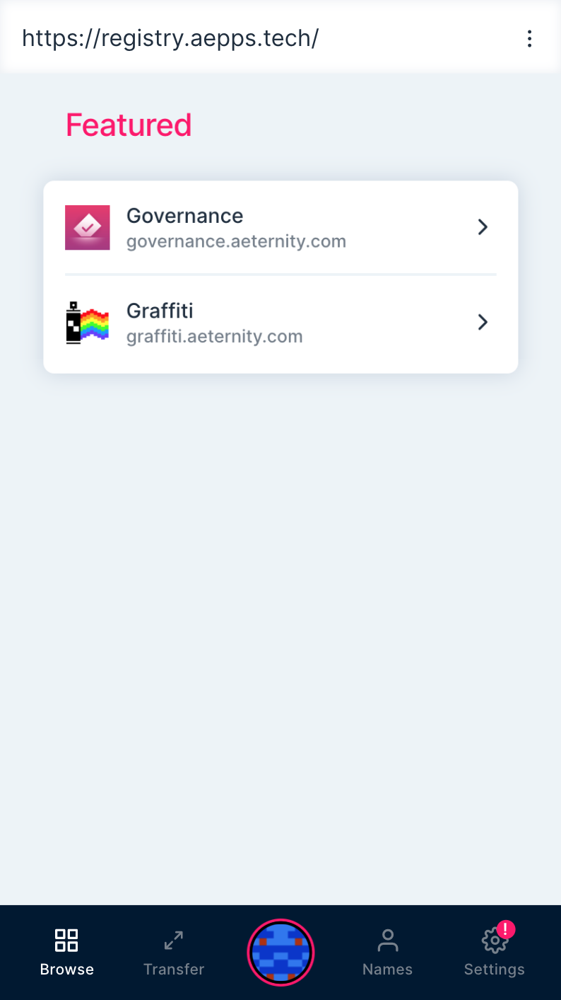
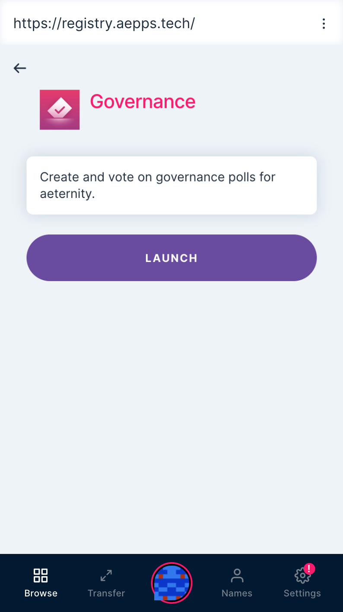

# AEX-130: æpps Metadata Format Specification

```
AEX: 130
Title: æpps Meta Information Format
Author: Stoyan Vasilev (@j28), Denis Davidyuk (@davidyuk)
License: BSD-3-Clause
Discussions-To: https://forum.aeternity.com/t/aexpansion-proposal-aepps-metadata-format-specification/3987/9
Status: Draft
Type: Meta
Created: 2019-07-09
```


## Simple Summary

The goal of this document is to specify a format for metadata which æpps provide to æpp listing services, decentralized æpp stores, æpp browsers, and wallets.


## Abstract

A format which is consistenly used by developers is needed to facilitate the uniform and useful user experience of browsing aepps inside æpps browsers, wallets, and listing services.


## Motivation

The motivation behind this aexpansion is to improve the user experience of browsing æpps inside æpps browsers, wallets, and listing services. Our goal is to make it easy for users to recognize the purpose of an æpp/what the æpp allows its users to do and whether users would like to open the æpp and give it access to the account data it requests.


## Specification

### Format

#### Required members
+ Name of aepp
+ aepp icons
+ Networks the aepp is available on [mainnet, testnet]

#### Recommended members
+ aepp description
+ Category (select from predermined list)
+ Author
+ Author URL
+ Related applications
+ Age restrictions/rating

### References


Reference visuals for the result of implementing such metadata format are included below.

| A service listing aepps | Detail view of a aepp metadata rendered inside a aepp browser |
|---|---|
|  |  |

## Rationale

We are leveraging the webmanifest format and augmenting it to fit the needs of the blockchain context. The premise is that this format can be universal (used by multiple protocols, with only one field difference).

### Other considerations
+ Consider if aeppsmanifest format applies to both web and non-web contexts.

+ This proposal does not address whether metadata provided by an aepp is accurate/truthful.

### Future Considerations

+ This proposal does not articulate a stance on storage concerns (as aepp metadata can be rendered dynamically or stored locally).
+ This proposal does not address the concern of aepps sharing aepps data between themselves.


## Implementation

### Required members

#### `name` member
Documentation: https://www.w3.org/TR/appmanifest/#name-member

#### `icons` member
Documentation: https://www.w3.org/TR/appmanifest/#icons-member

#### `aeternity_network_ids` member
An array of `AeternityNetworkIdType` items, each item represents id of the network that aepp is compatible with. The persistence of this member means that aepp supports aeternity protocol.

`AeternityNetworkIdType` is a string, allowed values: `ae_mainnet`, `ae_uat` (testnet).

### Recommended members

#### `description` member
Documentation: https://www.w3.org/TR/appmanifest/#description-member

#### `category` member
Documentation: https://www.w3.org/TR/appmanifest/#categories-member
List of known values: https://github.com/w3c/manifest/wiki/Categories


#### `author` member

The `author` member is a string that represents the name of author.

#### `author_url` member

The `author_url` member is a string that represents the URL of the author's website.

### Additional members

#### `iarc_rating_id` member
Could be used to set age restrictions/ratings.
Documentation: https://www.w3.org/TR/appmanifest/#iarc_rating_id-member

### Binding of marketing websites to a corresponding aepp

The web manifest file of a marketing website should point to an aepp using [`related_applications`](https://www.w3.org/TR/appmanifest/#related_applications-member) member.

### Reference implementation 
http://aeternity.com/aepp-base-example/webmanifest.json
___

### References

Web App Manifest standard: https://www.w3.org/TR/appmanifest/
Extensions Registry: https://github.com/w3c/manifest/wiki/Extensions-Registry

___

### Comments

*[MDN documentation](https://developer.mozilla.org/en-US/docs/Web/Manifest) says*
> PWA manifests include its name, **author**, icon(s), version, description, and list of all the necessary resources (among other things).

*DD: I can't find a specific way to add author info except for adding it as a part of another member (for example, at the end of `description` member). Because of this, I am defining the `author` member in this document.*

## Copyright

