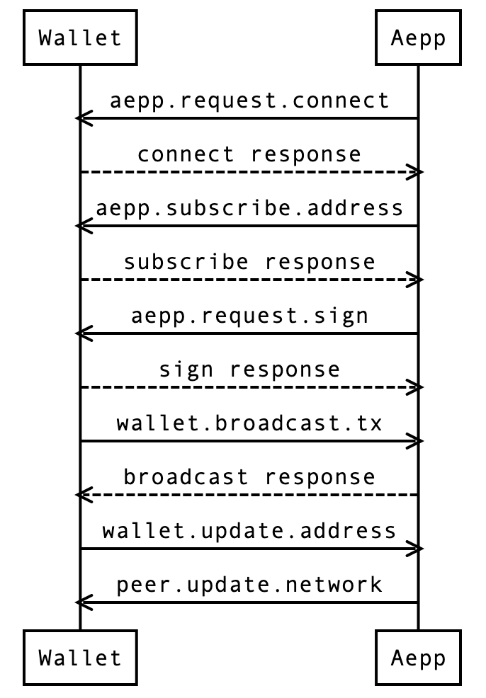

# AEX 2

```
AEX: 2
Title: Third-party Wallet Provider Support
Author: Shubhendu Shekhar (@shekhar-shubhendu), Andrea Giacobino (@noandrea), Enrico Icardi (@ricricucit) & Nazar Duchak (@nduchak)
License: BSD-3-Clause
Discussions-To: https://forum.aeternity.com/t/aex-2-js-sdk-interfaces-for-wallets/2715
License-Code: Apache-2.0
Status: Review
Type: Standards Track
Created: 2019-03-04
```

## Simple Summary

The key words "MUST", "MUST NOT", "REQUIRED", "SHALL", "SHALL NOT", "SHOULD",
"SHOULD NOT", "RECOMMENDED",  "MAY", and "OPTIONAL" in this document are to
be interpreted as described in [RFC 2119](https://tools.ietf.org/html/rfc2119).

This document describes the technical specification and methods that the wallet provider (ex. Base æpp, Wællet, MetaMask) MUST use to interact with Aeternity based applications (hereinafter referred to as 'aepp' or 'aepps').

## Motivation

Currently, there exists no standard way for wallets and aepps to communicate and everything developed on the SDK side is developed only keeping the Base æpp in mind and rest of the wallet providers need to follow the same path.
By defining the standard way of communication between aepps and Wallet we will not only reduce the dependency that other wallet providers have on the Base æpp as well as we'll have a clear standard method of communication on the SDK side that can be further extended upon whenever required.

## Specification

### Naming Convention

Wherever possible, this document tries to closely follow the `who.what.how` naming convention for JSON-RPC methods.

### JSON-RPC 2.0 Specification

#### Error

JSON-RPC 2.0 response error object that is used to communicate any error occurred while processing the request.

##### Types of errors

  |**Code**|**Message**|**Meaning**|
  |:-----:|:-----:|:-----:|
  |1|Transaction verification failed| MUST be returned when verification of signed transaction fails.|
  |2|Invalid transaction| MUST be returned whenever the transaction validity check fails|
  |3|Broadcast failed| MUST be returned by the aepp or wallet if it has been unable to broadcast the transaction.|
  |4|Signature request denied| MUST be returned by the wallet when it denies the signature request by aepp.|
  |5|Subscription denied| MUST be returned by the wallet whenever it denies an address subscription request.|
  |6|Unsupported protocol version| MUST be returned by aepp when it does not support protocol version the wallet wants to connect through.|

#### Methods

##### Aepp Invokable Methods

  This section defines the methods that the aepps MUST invoke to either get information from the wallet or request the wallet to perform an action.

- `connection.open`: connection request sent by the aepp to the wallet.

  **Parameters**

    _Object_

    - `version`: protocol version. Currently defaults to `1`.

  **Returns**

    _Object_

    - `network`: Network id used by the wallet
    
  **Returns errors**
  
  - Unsupported protocol version
  - Unsupported network

- `address.subscribe`: request the wallet to get or subscribe to address changes. This method MUST return only if the aepp is successfully subscribed else it MUST throw the appropriate error.

    **Parameters**

    _Object_

    - `type`: payload indicating the type of update i.e. subscription or un-subscription. This supports two options:
      - `subscribe` (datatype: string): MUST be used by the aepp to request a subscription.
      - `unsubscribe` (datatype: string): MUST be used by the aepp to request an un-subscription.
    - `value`: indicating the subscription/un-subscription that needs to be handled Currently supported options:
      - `current` (datatype: string): MUST be used to for current user account
      - `connected` (datatype: string): MUST be used for connected wallet accounts.

  **Returns**

    _Object_

    - `subscription`: Array of string indicating the current subscriptions. Example: `['current', 'connected']`
    - `address`: This is a nested JSON Object containing the subscribed addresses in the below defined format. Same as `address.update` notification, please refer for more details.
    This field MUST be included in the response when the wallet receives a subscription request i.e. when `type == 'subscribe'`.
    This field is OPTIONAL in the response when the wallet receives an un-subscription request i.e. when `type == 'unsubscribe'`.
    
  **Returns errors**
  
  - Subscription denied

  **Account Format:**

  ```json
    {
        "<subscription_type>": {
            "<account_public_key>": {
                "name": "<optional_human_readable_account_name>"
            }
        }
    }
  ```

- `transaction.sign`: request wallet for signature

  **Parameters**
  - unsigned encoded transaction (Datatype: String).

  **Returns**
    signed encoded transaction (Datatype: String)
    
  **Returns errors**
  - Invalid transaction
  - Signature request denied

##### Wallet Invokable Methods

  This section defines the methods that the wallet MUST invoke to either get information from the aepp or request the aepp to perform an operation.

- `transaction.broadcast`: Ask aepp to broadcast the transaction.

  **Parameters**

    _Object_
  - `tx`: signed encoded transaction (Datatype: String).
  - `verify`: Boolean. Perform verification before broadcasting or not.

  **Returns**

    _Object_

    - `tx_hash`: encoded transaction hash (Datatype: String).
    
  **Returns errors**
  
  - Broadcast failed
  - Transaction verification failed

#### Notifications

##### Wallet Invokable Notifications

- `connection.announcePresence`: MAY be used by the wallets to announce their presence wherever required (e.g. postMessage API). This message SHOULD NOT be used by the wallets where a 1-to-1 connection with the aepp is already established but instead wait for the aepp to initiate the connection using `connection.open` message.

  Note: This is a helper message for the aepp to identify the presence of a wallet.

  **Parameters**

    _Object_

    - `network`: Network id used by the wallet

- `network.update`: MUST be used by Wallet for informing Aepp about the change of network.

    **Parameters**

    _Object_
  - `network`: Updated network id.

- `address.update`: MUST be used by the wallet to notify subscribed aepps about the address change.

  **Parameters**

    _Object_
  - `address`: JSON Object. This MAY contain 1 or more keys but only of the below types. The values in the object completely depend on the aepp's subscription.

    **Subscription Type:**

    - `current`: Object containing only a single account currently in use by the wallet. The account MAY also have an embedded `name` key which is a human-readable name for the account.
    - `connected`: Object containing multiple connected accounts. The accounts MAY also have an embedded `name` key which is a human-readable name for the account.

    **Account Format:**

      ```json
        {
            "<subscription_type>": {
                "<account_public_key>": {
                    "name": "<optional_human_readable_account_name>"
                }
            }
        }
      ```

##### Invokable by Wallet and Aepp

- `connection.close`: MUST be used by Aepp or Wallet for informing the other party that it is disconnecting and further requests will either be denied or not acknowledged.

## Example Flow

<p align="center">
	
</p>

## Reference Implementation

- Aepp: https://github.com/aeternity/aepp-sdk-js/tree/feature/aex-2/examples/browser/vuejs/connect-two-ae

- Extension Wallet: https://github.com/aeternity/aepp-sdk-js/tree/feature/aex-2/examples/browser/extension

## References

- Transaction Encoding and Serialization
  https://github.com/aeternity/protocol/blob/master/node/api/api_encoding.md
  https://github.com/aeternity/protocol/blob/master/serializations.md
